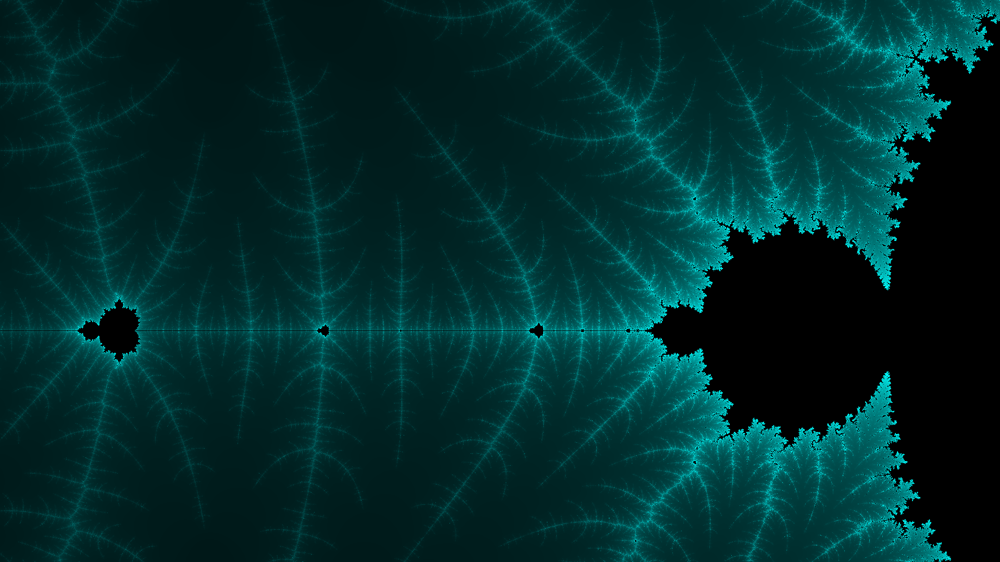

# Vision

## Overview · 概述
*Vision* 是一个基于 *H5 Canvas* 绘制API实现的 *JavaScript* 绘制框架。
现阶段主要用于自己进行 **想法的验证** 和 **相关知识体系的学习**。

--------------------------------------------------


--------------------------------------------------
## Spark · 火花
> Vison: 视野; 想象; 幻象; 梦幻

正如单词的含义，构建这个项目的目的在于通过代码来进行 **想法的可视化**。最早接触相关的是 *Processing*, 一种基于Java的用于实现电子艺术设计的编程框架。我之所以对此感兴趣是由于，相对于通常的程序设计不同。基于该框架的程序的输出并不是字符，而是*图像*，虽然从本质上都是 *数据*，但相对于字符却可以带给人更加的直观的感受。同时我惊叹于其他人创作的作品。这些作品大多并非出于某种实用性的目的构建，更多的像是用来展示作者的创意或者用于某种思想的表述。

正是出于这种非实用性的目的，带来了*探索的乐趣*，当我构建好一个项目后，常常喜欢通过改变系统中的参数，来观察这一变更会为整个系统带来什么不一样的变化。通过改变对象的参数，是否会产生新的运动模式？将不同的对象之间关联起来构成的整体又会呈现出什么新的模式吗？这样的尝试过程中往往会带来很多预想之外的惊喜，这种探索过程正是我构建此项目的主要原因。

另一个原因是在于进行想法的可视化，有时候在产生一些想法的时候，想要获取这些想法的直观的图像表述，但限于复杂性，用纸和笔来绘制可能达不到预期效果，因此想到通过代码来绘制或者模拟来实现想法的可视化。

总之，我对这个项目的期望是：

> *Vision* 框架是一座桥梁，用于连接想法创意与现实。一种将想法与创意进行可视化的绘制框架。

--------------------------------------------------
## Docs · 文档 
* [DevStandard · 开发规范](./docs/DevStandard.md)
* [Spark · 想法与灵感记录](./Spark.md)

--------------------------------------------------
## Blogs · 博客
* [Mandelbrot_Set_Visualization · 曼德勃罗特集的可视化](./docs/blogs/Mandelbrot_Set_Visualization.md)

--------------------------------------------------
## Update · 更新日志
* [NNS(Nearest Neighbor Search)](./src/algo/NNS.js) : 邻近搜索算法，在数据(向量)集中搜索给定目标的邻近集。
* [ParticleSystem](./src/particle/particle.js) : 粒子系统结构优化，新增Hook机制。
* [Boids](./src/algo/Boids.js) : 集群行为模拟 —— *Boids* 基础模型实现 [(演示)](./views/Research/Boids/boids.html)

--------------------------------------------------
## DevPlan · 开发计划
### 阶段计划
  * NNS(邻近搜索)算法实现: KD树
  * PSO(粒子群优化)算法实现
  * KNN分类器实现
  * sort(排序)算法模块实现
  * TrailTracker(轨迹追踪器)对象结构优化，考虑采用 Proxy | Reflect 实现。 
  * 连杆系统
  * 贝塞尔曲线
### 持续开发
  * ***VisionProtocol*** 绘制协议 : 通过该抽象层实现绘制模块与绘图上下文容器的解耦
  * 离线渲染模块(初步架构) : WebSocket + Node Server + Selenium
  * 文档自动构建工具 : 基于源码的注解自动生成文档
  * 计算性能优化(参考《高性能Javascript》)
  * **Vector** 模块性能优化 : 基于 *WebAssembly* 重构

--------------------------------------------------
## Index · 项目目录结构索引(概览)
* */build* : 项目构建工具目录
* */docs* : 项目文档目录
* */src* : 源码目录
* */test* : 测试代码目录
* */tools* : 辅助开发/设计工具目录
* */views* : 项目应用目录
* */vtp* : Views模板构建工具目录

**详细目录结构索引** : [DevIndex](./docs/DevIndex.md) 

--------------------------------------------------
## Build · 项目构建
* 项目构建器 
```shell
npm run build
```

* Views模板构建器
```shell
# 查看当前模板
npm run vtp -- -list
# 生成模板
npm run vtp -- 文件名 模板名  
# exp: npm run vtp -- test pcs
```
* 项目测试(基于jest)
```shell
npm run test
```

--------------------------------------------------
## Application · 应用
### [*Mandelbrot_Set*](./views/Algorithm/Mandelbrot_Set/Mandelbrot_Set.html)

### [*LightRing*](./views/Projects/Ring/LightRing.html)

### [*L-System*](./views/Algorithm/LSystem/plants.html)

### [*Helix*](./views/Projects/Helix/Helix.html)

### [*Boids*](./views/Research/Boids/boids_M0S1.html)

### [*TransfGravityParticle*](./views/Research/ParticleSystem/TransfGravityParticle.html)

### [*The Life of Tree*](./views/Projects/The%20Life%20of%20Tree/The%20Life%20of%20Tree.html)
