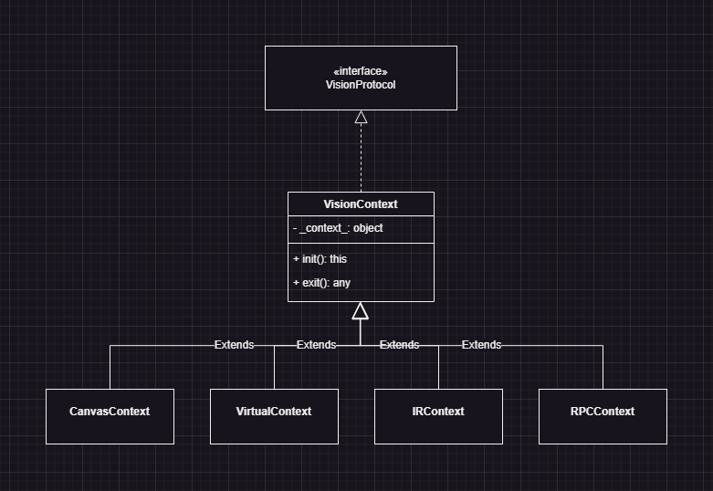
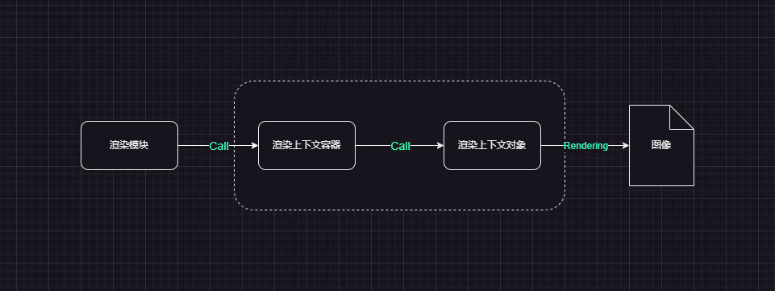
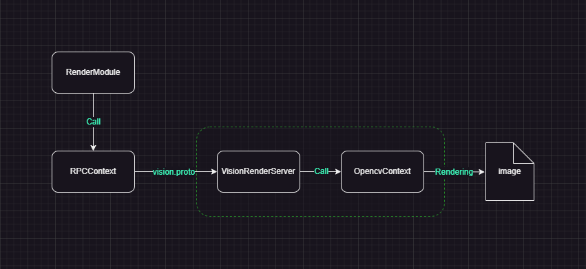

# VisionProtocol · 抽象层设计

## 目录
- [问题背景](#问题背景)
- [抽象层设计](#抽象层设计)
  - [VisionProtocol 架构设计](#visionprotocol-架构设计)
  - [VisionProtocol 接口定义](#visionprotocol-接口定义)
  - [VisionProtocol 设计思想](#visionprotocol-设计思想)
- [运行环境兼容性架构](#运行环境兼容性架构)
  - [渲染上下文容器](#渲染上下文容器)
  - [方案验证](#方案验证)
- [跨语言渲染架构](#跨语言渲染架构)
  - [方案演进过程](#方案演进过程)
    - [1. 无界面渲染](#1-无界面渲染)
    - [2. 中间代码](#2-中间代码)
    - [3. 数据通信协议](#3-数据通信协议)
  - [架构设计](#架构设计)
  - [方案验证](#方案验证)
  - [方案评估](#方案评估)
- [总结](#总结)

--------------------------------------------------
## 问题背景

Vision框架中的代码从逻辑上可以拆分成 ***计算逻辑/模块*** 与 ***渲染逻辑/模块*** 这两个主要部分。

**计算逻辑** 通常具有高度的抽象性，其设计基于抽象的数学模型。这个部分的主要作用是进行数据计算，比如向量计算和粒子系统中粒子状态计算等。计算模块的输出数据将作为渲染模块的输入(比如粒子的坐标向量数据)。这种抽象性意味着从设计上来看，计算逻辑是与语言和渲染无关的。Vision项目中的 JavaScript 代码可以看做是一种具体实现，同时这种抽象性意味着移植性，在新的编程语言框架下，同样的计算逻辑只需结合语言特性修改实现细节，即可完成相同计算逻辑的复现。因此在计算逻辑的实现中，应尽量减少与编程语言特性的依赖。

相对于抽象的计算逻辑，**渲染逻辑** 则是与 **渲染上下文对象(context)** 强耦合的。渲染模块需要对 **context** 进行调用来实现渲染和绘制功能，这种耦合关系导致绘制代码只能在单一的环境下运行。在vision项目的早期阶段，渲染模块需要依赖于 **Canvas上下文对象** 进行渲染，因此无法脱离浏览器环境运行。在考虑采用 Nodejs 作为离线渲染方案的运行环境时，由于环境缺乏 **Canvas上下文对象** 导致代码无法兼容运行。因此需要一种 **运行环境兼容性架构** 来让渲染模块在不同的环境下兼容运行。

**VisionProtocl** 的核心目标就是通过 **抽象层** 来解除 **渲染模块** 与 **渲染上下文对象** 的强耦合性。

概念定义 : 
  * 渲染模块 : 通过调用 **渲染上下文对象** 提供的渲染API，根据 **计算模块** 的输出数据实现图像的渲染和绘制功能。
  * 渲染上下文对象(context) : 提供具体的渲染API的对象，比如浏览器环境的 Canvas 对象。渲染模块需要调用该对象实现渲染。context 通常与代码运行环境相关联。  
  * 运行环境 : 指渲染模块的运行环境，比如浏览器或者nodejs。
 
--------------------------------------------------
## 抽象层设计

### VisionProtocol 架构设计
为了解决上述问题，通过在 **渲染模块** 与 **渲染上下文对象** 之间引入一个抽象层来进行解耦，整体架构如下:


通过 VisionProtocol 抽象层的架构，渲染模块不再直接调用具体的 **渲染上下文对象**，而是面向 VisionProtocol 中的抽象接口进行构建，这种架构解除了与渲染上下文对象的耦合，同时消除了渲染模块与运行环境之间的依赖。为后续的 **运行环境兼容性架构** 和 **跨语言渲染架构方案** 提供了基础架构。另外需要注意的是，虽然 VisionProtocol 的具体代码实现是以 JavaScript 类的描述方式，但是从抽象层的观点来看，VisionProtocol 应该视作模块之间的一种 **通信协议**。其定义了 **渲染模块** 与 **渲染上下文对象** 之间的交互方式。

### VisionProtocol 接口定义
VisionProtocl 抽象接口的简要定义如下 : 
```js
/** 渲染协议 */
class VisionProtocol {

    /** 刷新画布 */
    refresh(color=[50, 50, 50], width=1920, height=1080) {}
    
    /** 绘制直线 */
    line(xs, ys, xe, ye, {color=[255, 255, 255], lineWidth=1}={}) {}

    /** 绘制圆 */
    circle(x, y, r, {color=[255, 255, 255], lineWidth=1, fill=false}={}) {}
    
}
```
完整定义参考 [VisionProtocol](./src/protocol/protocol.js)

### VisionProtocol 设计思想
VisionProtocol API采用 **原子化** 的设计，其设计思想来源于对以下问题的思考:
> 如何渲染图像？图像的构成单元是什么？在绘制一张复杂图像时其基本的 "原子" 操作有哪些？

从最基本的 **像素视角** 来看，可以把数字图像视作一个 **二维像素矩阵**，矩阵中的每个单元为一个 **颜色向量**。
```js
let pixel = new Vector(r, g, b);
let img = [
    [p1, p2, p3, ..., pn],
    [p1, p2, p3, ..., pn],
    ...
    [p1, p2, p3, ..., pn],
]
```
其中 img[y][x] 中 (x, y) 为像素的坐标， 值为3个分量的颜色向量。
那么基于上述视角，渲染图像的 "原子" 操作可以看做是对矩阵指定坐标的颜色向量进行填充赋值。
```js
let setPixel = function(img, x, y, pixel) {
    img[y][x] = pixel;
}
```

从另一种更高层次的 **形状视角** 来看，可以将一张图像拆解成由一系列基本图形构成的集合。
```js
let img = [
    Circle(x, y, r, color),
    Line(xs, ys, xe, ye, color),
    ...
]
```
那么这种视角下的 "原子" 操作可以视作为在画布上绘制基本图形。
```js
let circle = function(img, x, y, r, color) {};
let line = function(img, xs, ys, xe, ye, color) {};
...
```
考虑构成图形的基本图形单元，从最根本的构成来看，所有图形都是由 **Point/点** 构成的，这实际上等价于 **像素视角**，因此考虑更 “上层” 的形状，比如 **Line/直线** 可以发现

> 任何复杂图形都可以拆解为 Line 的(近似)集合，即 Line 可以作为 **基本单元** 来构建图像。

比如可以考虑两类典型的复杂图形:
1. 任意多边形: 从定义来讲多边形就是直线的集合。
2. 任意曲线: 对于任意曲线，考虑这样一个过程，选择曲线上的一个点作为起点，沿着曲线按照距离 **N** 记录坐标点(Point)，直到曲线终点(或者闭合曲线的起点)。连接记录的坐标点，就可以得到曲线对应的 **近似多边形**，当 **N** 取值越小，近似程度越高。
3. 圆: 等价于闭合曲线

因此从理论上来讲，在Vision项目的场景中，**Line** 可以作为 **基本单元** 来构建 VisionProtocol API，但是考虑具体实现和用户代码调用的因素，会添加额外接口，比如 *circle*, *rect*, *polygon* 这些“复杂图形”API。
 
对于 VisionProtocol 的API设计，采用的是基于 **形状视角** 的方案，这是因为 **像素视角** 相对来说更加偏向 *底层*，在用户代码进行 *渲染模块* 的构建时实现更复杂。同时在考虑跨语言渲染方案时，同一段渲染逻辑实现，**像素视角** 方案的调用次数更多，导致通信过程的数据量增加，从而影响性能。

--------------------------------------------------
## 运行环境兼容性架构
在 Vision 项目的早期开发阶段是基于 CanvasAPI 设计的，这导致了 **渲染模块** 与 **Canvas上下文对象** 的强耦合，同时需要依赖于浏览器运行环境。也正是这种耦合，导致渲染模块无法在其他环境运行(Nodejs)，因为其他环境缺少 **Canvas上下文对象**。为了后续 **跨语言渲染架构方案** 的实现，渲染模块在多种环境下的兼容运行是一个必要的前置条件。

为了解决上述问题，通过基于 **VisionProtocol** 接口的 **渲染上下文容器** 来分离 **渲染模块** 与 **渲染上下文对象**，从而实现渲染模块在不同环境下的兼容性运行方案。

### 渲染上下文容器
渲染上下文容器的架构设计如下:

```js
class VisionContext extends VisionProtocol {

    /**
     * @classdesc 渲染上下文容器(基类)
     * 
     * @property { Object } _context_ - 渲染上下文对象
     */
    constructor(width, height, BGC=[50, 50, 50]) {
        super();
        this._context_ = null;
    }

    /** 初始化 */
    init() {
        return this;
    }

    /** 退出 */
    exit() {

    }
}
```

渲染上下文容器(基类)(**VisionContext**) 是一个继承 **VisionProtocl** 接口的抽象类，其子类根据具体运行环境内的 **渲染上下文对象** 实现 VisionProtocl 接口来实现渲染功能。通过这种基于 **里氏替换原则** 的设计，渲染模块 不再与 渲染上下文对象 进行直接交互，而是基于 渲染上下文容器(基类) 进行构建。不同环境下的 渲染上下文对象 被封装到对应的 渲染上下文容器。当渲染模块需要在多种环境下运行时，通过切换对应的渲染上下文容器，来实现兼容性运行。同时这种隔离也让 渲染模块 具有了更高的抽象性。

运行环境兼容性架构的设计与实现并不是完美的。虽然 渲染上下文容器 实现了 渲染模块 与 渲染上下文对象 的解耦，但是同时也限制了系统的扩展性，即子类无法扩展新的 渲染接口，因为 VisionProtocl 描述了可用的渲染接口列表。如果一个子类要扩展这个列表，就会破坏里氏替换原则，从而破坏 渲染模块 兼容性运行的特征。

### 方案验证

**运行环境兼容性架构** 的验证demo位于 [/src/architecture/RuntimeCompatibility/](./src/architecture/RuntimeCompatibility/) 目录下。

* 渲染模块 : 测试的渲染模块 [示例](./src/test/helix.js) 位于 [/src/test/](./src/test/) 目录下。
* 浏览器运行环境 : [browser_runtime_env.html](./src/architecture/RuntimeCompatibility/browser_runtime_env.html) 为渲染模块使用 [CanvasContext](./src/context/CanvasContext.js) 在浏览器环境运行的样例。
* Nodejs运行环境 : [nodejs_runtime_env.js](./src/architecture/RuntimeCompatibility/nodejs_runtime_env.js) 则为渲染模块使用 [VirtualContext](./src/context/VirtualContext.js) 在 nodejs 环境下运行的样例。

上述样例展示了 **渲染模块** 通过切换 **渲染上下文容器** 在两个运行环境下兼容运行的场景。从而实现了 **运行环境兼容性架构**，这也为后续实现 **跨语言渲染方案** 提供了基础。
 
--------------------------------------------------
## 跨语言渲染架构
随着 Vision 项目的持续发展，现有的依赖于浏览器环境的渲染架构, 逐渐暴露出一系列问题:  

1. **渲染性能问题** : 随着渲染模块的结构越来越复杂，基于 JavaScript 和 Canvas 的渲染架构性能问题逐渐明显，特别是在渲染 **大规模粒子系统** 时，随着粒子数量增多，渲染延迟越来越大。 

2. **离屏渲染需求** : 在构建需要长时间迭代演化的模块时(比如元胞自动机等)，其渲染过程往往需要很长时间，在浏览器运行环境下，需要依赖一个可视化的界面进行长时间运行，无法后台运行，因此需要一种 **离屏渲染方案** 实现 **以无界面的模式运行目标模块**。

3. **渲染模块服务化** : 当实现具有复杂参数的模块时，往往需要研究模块在不同参数下的运行/渲染情况，最简单的方法是通过手动修改目标参数来实现，同时在运行过程中记录下渲染结果(截图)。这种方式显然是繁琐的，因此迫切的需要一种自动化的 **渲染任务调度服务**，通过指定目标模块和运行参数来构建目标模块，并在服务端执行，同时记录下渲染结果或中间过程。

跨语言渲染架构的核心目的是为了解决渲染层对浏览器的依赖和对无界面运行的需求，为了项目的后续发展，开始针对以上问题研究解决方案。

### 方案演进过程

#### 1. 无界面渲染
最初的解决方案围绕以 **如果进行无界面地运行目标模块** 为主要思路。得益于自己在网络数据采集方向的经验，自然地想到 selenium 结合 headless 浏览器的方案。
初步思路是通过 selenium 启动一个 headless 浏览器，并在其中注入目标模块进行渲染，再通过 WebSocket 将渲染后的图像发送到 Node_Server 进行转存。

通过对上述方案进行验证，发现主要有以下问题:

1. 代码动态注入方案实现复杂: 在初步的验证demo中，是通过硬编码的方式在 selenium 中对目标模块进行注入(导入)，同时 WebSocket 代码也是是硬编码到 目标模块的。如果要构建完整的可行方案，需要实现对上述两个模块的 *动态注入* 功能。难点在于 WebSocket 代码的注入。考虑以下两种方案:
   * 主动注入: 这种方式需要在渲染模块中预留 WebSocket 代码的注入接口。在运行时填充 WebSocket 模块对象实现注入。
   * 被动注入: 将渲染模块设计成被动调用的组件，通过在基于 WebSocket 构建的渲染框架对象中，加载渲染模块中的各个组件实现注入。   
对于上述两种代码注入方案, 都需要对渲染模块的代码做结构限制，降低了构建的自由度。

2. 通信协议设计复杂: 需要基于 WebSocket 开发一套应用层的通信协议，在 selenium 渲染进程与 Server 端之间进行渲染结果的数据交换(图像数据传输)。

3. 运行环境依赖: 渲染模块需要依赖于浏览器运行环境，这显然与 Vision 项目的 运行环境兼容性架构 背道而驰。

上述方案虽然解决了无界面渲染的问题，但就方案的整体可行性来说却不太理想，首先是 WebSocket 代码注入的问题，虽然可以考虑基于 运行环境兼容性架构 设计一个专用的 WebSocketContext 来注入 WebSocket 代码。但是依旧将模块的渲染限制在浏览器环境。同时基于 WebSocket 的图像数据交换协议也需要仔细考量。因此继续考虑其他解决思路。

#### 2. 中间代码
对于第一种方案，渲染模块的目标代码执行后输出的是经过浏览器渲染后的图像。更进一步的分析渲染模块的执行流程。可以拆分出以下逻辑结构:

  
> 渲染模块 -> 渲染上下文容器(API调用) -> 渲染上下文对象(图像渲染) -> 图像数据

通过上述流程分析可以发现，图像渲染的实际过程发生在 渲染上下文对象(CanvasContext) 中，这也正是与浏览器产生依赖的地方。得益于运行环境兼容性架构，渲染模块的设计是面向抽象的，其实现与渲染上下文对象无关。因此解决问题的关键在于将图像渲染的过程与其他流程分离开来。

将上述 *渲染模块的执行流程* 与 *代码的编译执行流程* 大致类比一下，可以发现这两个流程有一定的相似之处。源代码(渲染模块) 经过编译器(渲染上下文容器) 编译成目标代码(VisionProtocol接口API调用集)，再通过 处理器(渲染上下文对象) 进行执行(渲染)。不同的渲染上下文对象可以看作是不同的处理器平台。虽然有点强行的意思，但是这个类比为问题的解决方案提供了思路。

**中间代码** 的解决方案基于下面这个核心观点: 

> 渲染模块的代码可以等价表示为 VisionProtocol 接口的调用集合。

因此可以基于 **运行环境兼容性架构** 构建一个特殊的 **渲染上下文容器(IRContext)**, 将渲染模块的运行结果转译成 VisionProtocol 接口的调用集合，并通过一种自定义的 **中间代码** 形式进行存储和传输，然后通过 **渲染解释器** 来读取并解释该 **中间代码** 以实现图像渲染。

> 渲染模块 -> IRContext(渲染上下文容器) -> 中间代码 -> Renderer(渲染解释器)

通过这种架构将图像渲染的部分从原有流程中分离出来，具体的渲染实现交由 **渲染解释器** 来完成，浏览器渲染可以看作是一个特殊实现。**渲染解释器** 也可以采用异构(语言)的方式实现渲染。需要注意的是，该方案中的中间代码概念与编译器中的概念有一定区别。编译器的中间代码通常是基于源码构建的，而这里的中间代码则可以看作是渲染模块运行后输出数据的一种特殊表示。或者说 **中间代码** 是一种 **数据交换协议**。

方案验证demo位于 [中间代码方案验证demo](./src/architecture/CrossLanguageRenderer/), 其中
* [IRContext](./src/context/IRContext.js) : 中间代码渲染上下文容器，用于生成中间代码。中间代码的格式定义如下
```json
{
    "cmd": "指令名",
    "param": "指令参数"
}
```
* [VisionRenderInterpreter](./src/architecture/CrossLanguageRenderer/VisionRenderInterpreter.py) : 渲染解释器，用于读取并对中间代码进行解释，并生成渲染图像。
```python
# 渲染调用
def rendering(self, IRcode_filepath):
    vision_IRcode = []
    # 导入中间代码
    with open(IRcode_filepath, "r", encoding="utf-8") as f:
        vision_IRcode = [json.loads(code) for code in f.readlines() if code]
    # 根据中间代码渲染图像
    [getattr(self.context, IRcode["cmd"])(**IRcode["param"]) for IRcode in vision_IRcode]
```

通过 **中间代码** 这种架构，使渲染模块的整个运行流程可以不依赖于浏览器实现无界面的渲染。相较于第一种方案，不再依赖于浏览器环境实现具体的渲染功能。而是将具体的渲染实现交给 **渲染解释器** 负责，**渲染解释器** 面向中间代码设计，从而可以支持异构的语言实现。

但是通过demo的验证，发现该方案最大的难点在于 **中间代码** 的结构设计。  
1. 中间代码结构设计问题: 在验证demo中，中间代码采用了一种类似json的数据结构设计，这种设计虽然实现简单，但是数据未进行压缩处理，导致在渲染模块比较复杂时，产生的中间代码数据量过大，这影响了存储和传输过程。
2. 渲染的实时性问题: 同时这种方案的渲染并不是实时的，因为需要先运行渲染模块生成中间代码文件，再让渲染解释器读取该文件进行渲染。针对需要长周期迭代的渲染模块，中间代码文件会占用很大的存储空间。虽然为了解决这个问题，可以考虑通过 socket 构建一个实时通信的数据接口，进行中间代码的传输，但是这里跟第一种方案一样，需要构建一个可靠的应用层通信协议，这同样是一个难点。

虽然 **中间代码** 的方案在实现过程中有一定的难点，但是这种基于 **数据协议** 的想法正是解决问题的关键，因此基于这个思路对具体的实现细节进行深入研究。


#### 3. 数据通信协议 
基于 **中间代码** 的思路，从另一个视角来考虑新的解决方案。对于第二种方案中的 **中间代码**，从某种角度来看可以将其视作 **渲染模块** 与 **渲染解释器** 之间的一种 **数据通信协议**。在这种观点下，渲染模块中渲染方法的调用可以看作是对渲染解释器中对应方法的调用，即远程过程调用(RPC)。那么第二种方案的两个问题实际上在现有的RPC框架中已经有了成熟的解决方案。从RPC的角度来看，中间代码实际上是一种数据序列化协议。因此基于 RPC 和 环境兼容性架构 来实现跨语言渲染架构。

### 架构设计
基于 RPC(gRPC) 和 环境兼容性架构 的跨语言渲染方案的整体架构如下:



* Protocol - 通信协议 ([vision.proto](./src/protocol/vision.proto)) : 基于 VisionProtocol 使用 ProtoBuf 构建数据序列化协议 
```
    service VisionRendererAPI {
        rpc refresh (Background) returns (Response) {};
        rpc line (Line) returns (Response) {};
        rpc circle (Circle) returns (Response) {};
        rpc rect (Rect) returns (Response) {};
        rpc polyline (stream Line) returns (Response) {};
        rpc polygon(Polygon) returns (Response) {};
    }
```
* Server - 渲染上下文容器 ([OpencvContext](./src/architecture/CrossLanguageRenderer/OpencvContext.py)) : 基于 VisionProtocol 使用 opencv API 构建渲染上下文容器。
* Server - 渲染服务器 ([VisionRenderServer](./src/architecture/CrossLanguageRenderer/VisionRenderServer.py)) : 构建 RPC 服务端，提供远程渲染调用服务(渲染解释器)。
* Client - 渲染上下文容器 ([RPCContext](./src/context/RPCContext.js)) : 构建RPC服务端，基于 vision.proto 构建 RPCContext 渲染上下文容器，用于进行远程渲染调用。

从上述架构可以看出，VisionProtocol 抽象层在其中充当抽象协议的作用。vision.proto 则是其使用 ProtoBuf 构建的一种具体实现。渲染模块在运行时，通过 RPCContext 将其调用参数序列化，并传输到 VisionRenderServer，VisionRenderServer 则通过 OpencvContext(基于VisionProtocol构建) 进行实际的渲染。

### 方案验证
**跨语言渲染架构** 的验证 demo 位于 [/src/architecture/CrossLanguageRenderer/](./src/architecture/CrossLanguageRenderer/) 目录。
测试方式如下：
1. 启动渲染服务器
```sh 
python ./VisionRenderServer.py
```  
2. 运行渲染模块
```sh
node ./render_module.js
```
渲染结果会输出到 [./img](./src/architecture/CrossLanguageRenderer/img) 目录下。上述样例展示了 **渲染模块** 通过无界面的方式运行(Nodejs环境)，并通过分离的 **渲染服务器** 不依赖于浏览器实现渲染。

### 方案评估
该方案很好地解决了开头提出的两个核心问题: 渲染层对浏览器环境的依赖和无界面运行的需求。同时保证了渲染模块的构建自由度和抽象性，即渲染模块面向 VisionProtocol 抽象层设计，不需要额外地引入其他结构来实现跨语言渲染的特性。具有更高的通用性。  

但是该方案并不是完美的，在验证demo中，出现了 **调用顺序依赖问题**，由于Nodejs采用的是异步调用的方式，因此在渲染服务器端无法保证渲染API的调用顺序，从而无法保证绘制顺序。表现的异常为帧与帧之间的绘制可能产生交叉，特别是对于有绘制顺序依赖的渲染模块表现更为明显，虽然可以通过将渲染服务器设置成同步模式来一定程度上缓解这个问题，但也只是一种临时解决放方案，后续在完善时需要详细考虑一下。

--------------------------------------------------
## 总结
基于 VisionProtocol 抽象层的设计，实现了 Vision 框架 **运行环境兼容性架构** 和 **跨语言渲染架构**。

通过 *渲染上下文容器* 的 **运行环境兼容性架构**，解决了 *渲染模块* 与 *渲染上下文对象* 的强耦合问题，让渲染模块具有和计算模块一样的抽象性和独立性，从而不再依赖于浏览器运行环境和Canvas上下文对象。使其可以在多种环境下运行。

而 **跨语言渲染架构** 设计，则使渲染模块可以无界面的运行，并且将渲染层从原有的结构中分离出来，实现了跨语言的异构渲染特性，为后续的 **渲染服务化架构** 提供了基础。 

随着 VisionProtocol 的设计与实现，Vision 项目结构逐渐从 lib(库) 转变为 framework(框架)。在后续的开发计划中，不单是进行基本代码的扩展与开发，还会逐步完善框架的生态构建。

### 开发构想:
#### 1. 渲染服务化架构 
现有渲染模块的运行都是通过显式地启动目标代码来运行。针对需要长周期迭代的渲染模块，需要开启浏览器界面等待运行结束来获取渲染结果。同时对于复杂参数的渲染模块，当需要研究该模块在不同参数下的运行状态时，只能通过手动修改目标参数并重新运行的方式。这显然是繁琐的。  

因此在 **跨语言渲染架构** 实现的无界面渲染的基础上，通过构建一种 **渲染服务化架构** 的设计来实现渲染模块的自动化(后台)运行。

该架构的初步构想包含两个核心组件，任务调度器与渲染执行器。
  * 任务调度器: 提供任务调度服务，客户端通过上传渲染模块，并提供运行参数来指定渲染模块的运行模式。调度器为其指定具体的渲染环境并监控其运行状态。
  * 渲染器集群: 接收调度器的调度，渲染模块的运行环境，通过提供的运行参数来进行渲染模块的具体运行，并记录其运行结果或中间过程。

渲染服务化架构的设计与实现是后续 Vision 项目架构层面的一个核心研究方向。

#### 2. 渲染模块标准化规范
制定渲染模块的结构规范，向外部提供统一的标准化调用接口，屏蔽渲染模块的内部实现细节。

#### 3. 运行环境切换组件
在渲染模块标准化规范的基础上，提供一个执行器，通过指定运行环境名和运行参数，调用渲染模块并自动填充对应环境的 *渲染上下文容器* 进行运行。这个组件的开发可以作为 *渲染服务化架构* 中渲染器的预研。 

